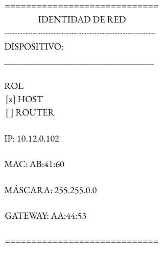
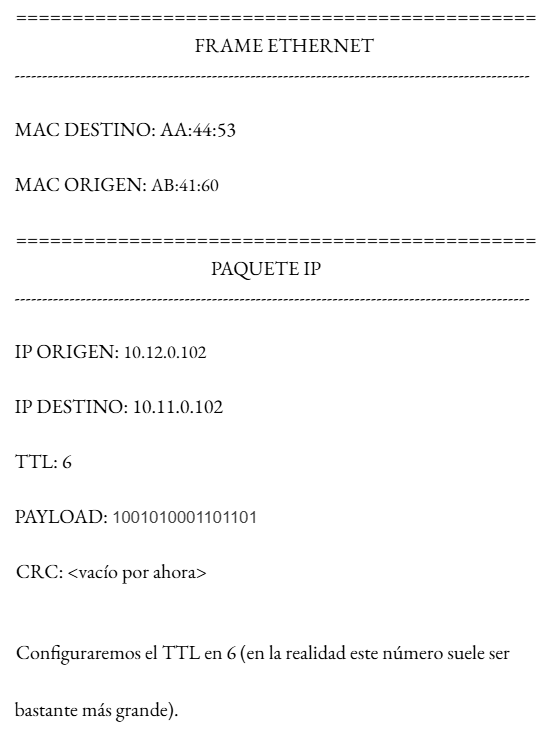
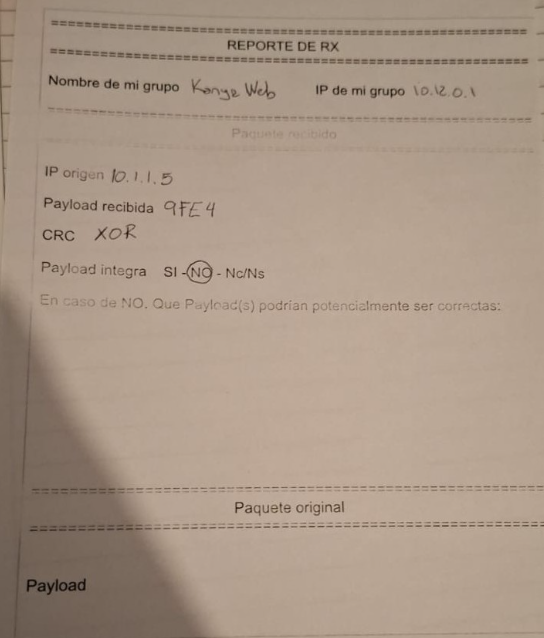
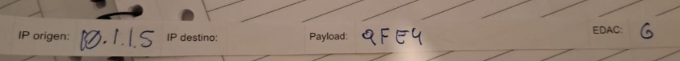

# Universidad Nacional de Córdoba

## Facultad de Ciencias Exactas, Físicas y Naturales

### Ingeniería en Computación

---

# Informe TP1 - Redes de Computadoras
**Materia:** Redes de Computadoras 
**Trabajo Práctico N°:** 1

**Alumnos:** Mateo Bernardi - Santiago Madrid  - Tomas Quinteros
**Año:** 2026  
**Profesor:** Ing. Facundo Oliva Cuneo - Ing. Santiago Henn
**Fecha de entrega:** 25/03/2026

---

### Parte 1 - Repaso general didáctico: Simulación de envío de paquetes, ARP y ruteo entre redes. 

Utilizando la tabla de datos dada, armamos nuestra tarjeta de identificacion con  los siguientes datos de interes:

Por otro lado, armamos un paquete para enviar en nuestra red siguiendo lo establecido en las tablas:

Con esto se realizo una simulación en clases de envio y recepción de datos  en una red.

a) Durante el laboratorio, la dirección IP destino del paquete se mantuvo constante mientras que la dirección MAC destino cambió en cada salto. ¿Por qué ocurre esto y qué nos dice sobre la diferencia entre direccionamiento lógico (IP) y direccionamiento físico (MAC)?
La ip destino se mantiene constante porque identifica inequívocamente al host en la red. Mientras que la mac corresponde al identificador físico del dispositivo de red al cual debemos enviar el paquete. En nuestro caso la mac de destino inicial era el router del Gateway. El cual al recibir el paquete y leerlo, cambia su mac de destino al siguiente para repetir el procedimiento. En todo momento la ip de destino queda constante ya que es la información que se necesita para seguir ruteando (mediante las tablas de ruteo)  el paquete hasta llegar al final. 

b) Cuando un host quiere enviar un paquete a un dispositivo en otra red, no intenta descubrir directamente la MAC del host destino, sino la del default gateway. ¿Por qué se utiliza este mecanismo y qué problema resolvería el gateway que el host no puede resolver por sí solo? 

Se utiliza este mecanismo porque el protocolo funciona mediante broadcast y los routers no reenvían tráfico de broadcast a otras redes. El default gateway resuelve dos problemas que el host no puede resolver por ser un dispositivo de extremo:
Enrutamiento: El host no sabe cómo regar a redes externas ni cuántos saltos hay. El gateway utiliza tablas de enrutamiento que le permiten determinar el mejor camino a destino.
Reencapsulamiento entre saltos: El gateway recibe la trama del host, la desencapsula para leer la IP destino final, y la reencapsula en una nueva trama de Capa 2 dirigida a la MAC del próximo router en el camino.

c) Cada router toma decisiones basándose únicamente en su tabla de ruteo local y no en el camino completo hacia el destino. ¿Qué ventajas tiene este modelo de ruteo hop-by-hop para redes grandes como Internet? 

Se basa únicamente en su tabla de ruteo porque esto le permite al router sólo conocer los dispositivos conectados directamente a él, y su default gateway. Las ventajas de esto son que aporta mayor rapidez a la actividad, que si se rompe uno de los caminos automáticamente se puede calcular uno nuevo, y además permite mayor modularidad porque cada router sólo necesita saber a dónde enviar el paquete en el próximo salto en lugar de conocer el camino entero.

d) En el laboratorio observamos que los routers desencapsulan y vuelven a encapsular el paquete en cada enlace. ¿Por qué es necesario reconstruir el frame Ethernet en cada salto y qué ocurriría si los routers intentaran reenviar exactamente el mismo frame? 

Los routers deben reencapsular los frames porque la Capa 2 opera salto a salto, y en cada salto deben actualizarse la MAC de origen y la MAC de destino. Además, al disminuir el TTL del paquete IP el contenido cambia, lo que obliga a recalcular el código de verificación de errores en la nueva trama. 
Si se envía el mismo frame, se descarta inmediatamente porque la MAC de destino no coincidiría con el siguiente salto. Además, al no restar TTL, un paquete podria quedar atrapado en un bucle de enrutamiento para siempre.

e) El campo TTL se decrementa en cada router. ¿Qué problema de la red previene este mecanismo y qué podría suceder si el TTL no existiera? 

Este mecanismo evita que los paquetes queden infinitamente circulando por la red. Si un paquete no llegó a destino por algún motivo en cada salto (hop) se decrementa el valor del TTL en 1. Al llegar a 0 se descarta el mismo. El TLL debe tener un valor suficiente para llegar a destino sin descartarse pero no tan alto para que este por siempre en la red en caso de no ser entregado y cause congestión o saturación.

### Parte 2. Inyección y detección de errores. 

1. Discutiremos en clases acerca de EDAC y los lineamientos precisos del laboratorio. El ejercicio es simple: 
a. Routers no default gateway (sin LAN debajo): al momento de re-empaquetar los paquetes, modificar (o no) en uno o más bits la payload. Documentar de manera secreta qué paquetes fueron modificados y que paquetes no (registrar payload + destino). Reenviar el paquete. 
b. Hosts / End devices: al enviar paquetes aplicar técnicas de EDAC. Al recibir paquetes, determinar si fueron o no modificados. Justificar. 

#### Envio
En el calculo de EDAC utilizamos paridad, para la realización del mismo contamos la cantidad de 1 por nibble. Utilizamos paridad par, de tal forma que si tenemos cantidad de 1 par ponemos un 0 y si tenemos impar ponemos un 1.
1110 0100 0010 0000 (E420)
Nibble paridad par: 1110
#### Recibida
Recibimos el siguiente paquete:
Payload: 9FE4
EDAC: 6
Determinamos que el mismo fue modificado, ya que se envío con detección de errores XOR. Al realizar el calculo de validación obtenemos:
Payload en binario: 1001 1111 1110 0100

Checksum:
- 1001 XOR 1111 = 0110
- 0110 XOR 1110 = 1000
- 1000 XOR 0100 = 1100

Resultado Final (Checksum) = 1100 
El resultado final equivale a una “C” en hexadecimal, el enviado es un 6. Podemos concluir que fue alterado. Para encontrar posibles valores, realizamos cambios en los nibbles recibidos para que las operaciones XOR al final termine en un 6. Estas son algunas de las combinaciones posibles:
1001 1111 1100 0100 (9FC4)
1001 1111 1110 1110 (9FEE)
En ambos casos el resultado del checksum XOR es el valor 6. 

