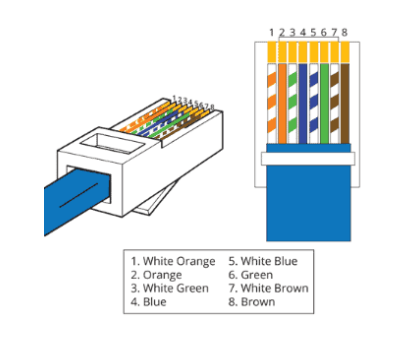
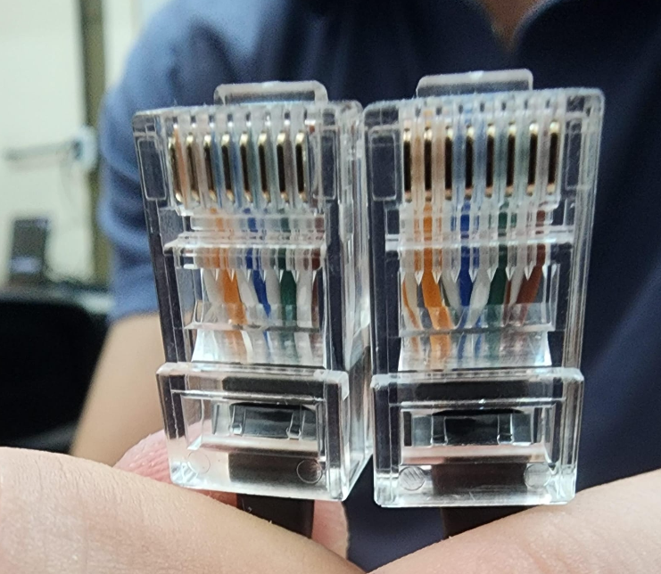

# Universidad Nacional de Córdoba

## Facultad de Ciencias Exactas, Físicas y Naturales

### Ingeniería en Computación

---

# Informe TP1 - Redes de Computadoras
**Materia:** Redes de Computadoras 
**Trabajo Práctico N°:** 2

**Alumnos:** Mateo Bernardi - Santiago Madrid  - Tomas Quinteros
**Año:** 2026  
**Profesor:** Ing. Facundo Oliva Cuneo - Ing. Santiago Henn
**Fecha de entrega:** 25/03/2026

---

## Parte 1 - Armado y verificación de cables Cat5/Cat5e

Objetivo: Tomar contacto con elementos de la capa física y ganar experiencia en el armado y verificación de conexiones de red.

### 1. Investigación y Estándar de Colores

Para este trabajo se utiliza la norma T568B para la construcción de un cable derecho (no cruzado). El orden de los pines según el diagrama es el siguiente:
- Pin 1: Blanco Naranja 
- Pin 2: Naranja 
- Pin 3: Blanco Verde 
- Pin 4: Azul 
- Pin 5: Blanco Azul 
- Pin 6: Green 
- Pin 7: Blanco Marrón 
- Pin 8: Marrón 

### 2. Construcción
Se procedió a construir un cable tipo derecho por grupo.

La longitud aproximada del cable es de 1 a 1.5 metros.

### 3. Verificación de Calidad
Para asegurar el correcto funcionamiento, se realizó lo siguiente:
- Inspección visual: Evaluación crítica de la calidad constructiva del conector y los hilos.
- Verificación eléctrica: Uso de un tester para cables Ethernet para confirmar la continuidad de los 8 hilos.
- Intercambio: Se documentó el intercambio del cable con otro grupo para realizar verificaciones cruzadas.

## Parte 2 - Equipamiento físico, verificación y utilización de equipos de red y análisis de tráfico.

Objetivo: Reconocer la anatomía de equipos de red, sus interfaces y funciones, y poner en funcionamiento un switch empresarial.

### 1. Características del Switch
Modelo: Cisco Catalyst 2950 Series.
Puertos: Cuenta con puertos 10/100 para conexión de red.
Interfaces traseras: Incluye conector de energía AC , conector RPS , salida de ventilación y el puerto de consola RJ-45.

### 2. Procedimiento de Configuración 
a) Conexión a la Consola
Conectar la PC al puerto de consola del switch utilizando un cable Serie a RJ-45.En caso de ser necesario, utilizar un adaptador Serie a USB.Configurar el software PuTTY para acceder mediante el puerto serie a 9600 baudios.
b) Administración del Switch
Acceder a las opciones de administración mediante la consola.Realizar la modificación de las claves de acceso del equipo.
c) Configuración de Red y Pruebas
Conectar las computadoras de dos o más grupos al switch utilizando los cables armados en la Parte 1.
Configurar el direccionamiento de red en las estaciones de trabajo.Verificar conectividad mediante el comando ping o mediante la captura de paquetes para analizar el comportamiento de protocolos como ARP, NDP e ICMP.
