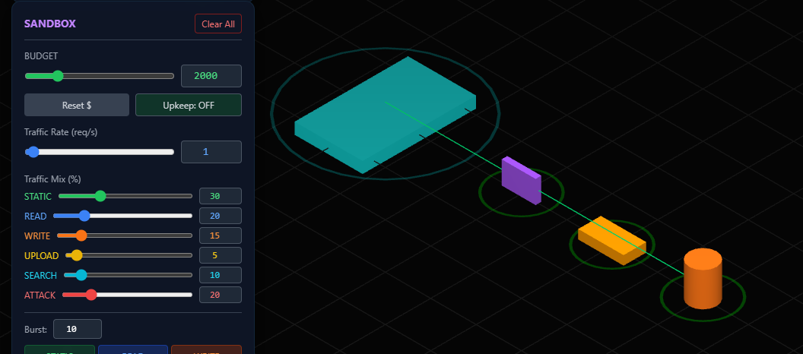
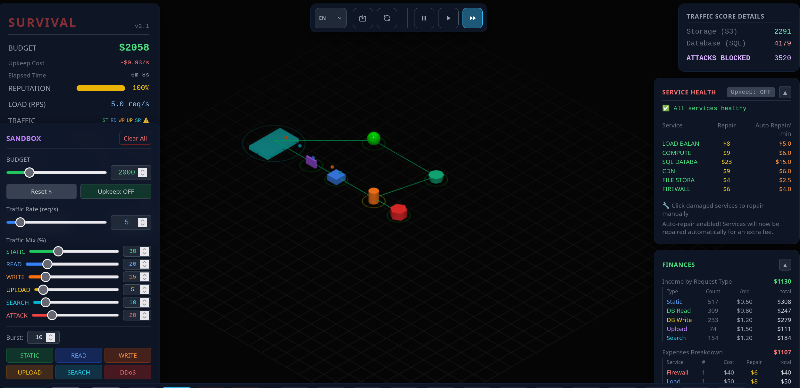
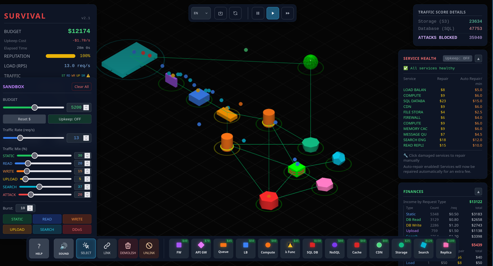
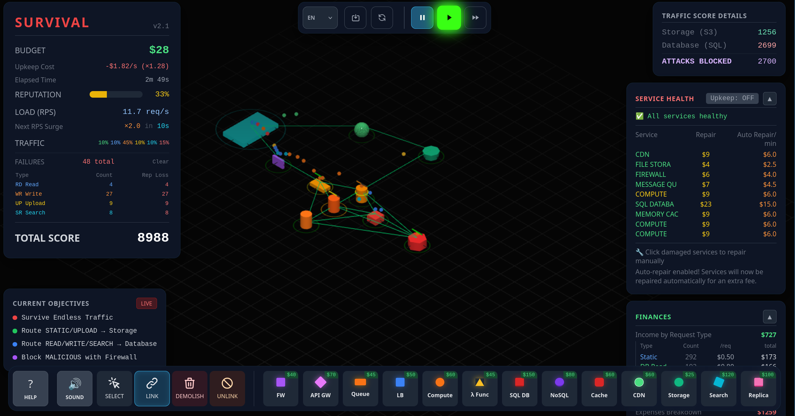
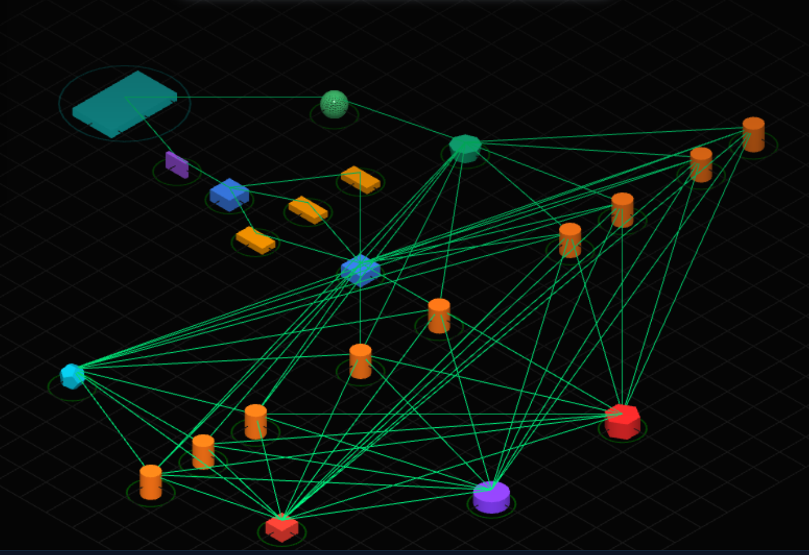
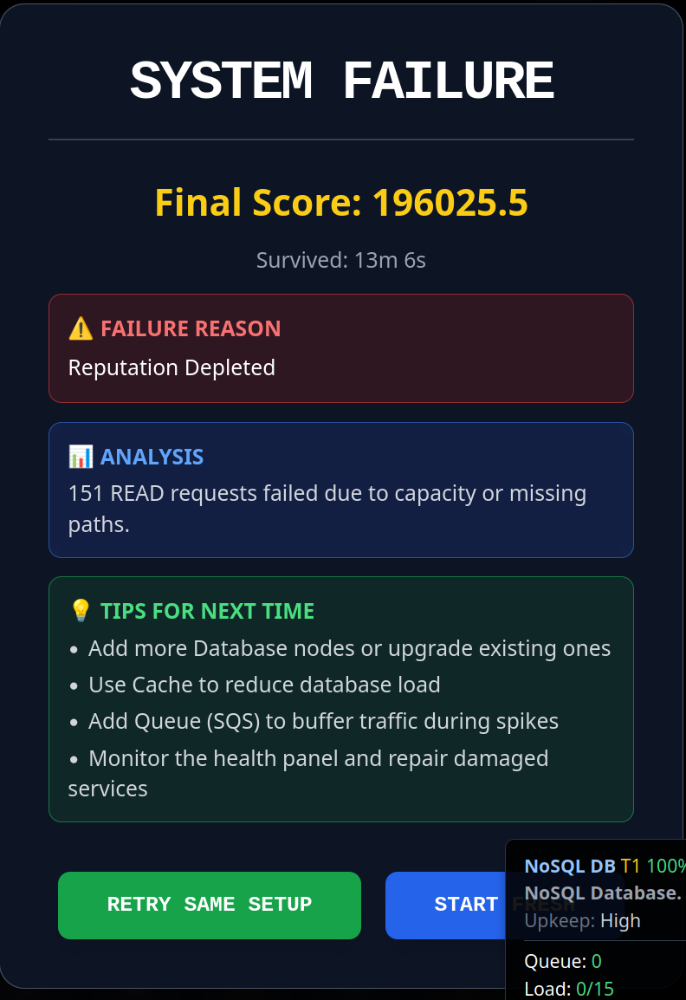

### **1) Reconocimiento de arquitectura**

**Firewall** 
* **a) Problema que resuelve:** Filtra y controla el tráfico entrante y saliente basándose en reglas de seguridad para prevenir accesos no autorizados y mitigar ataques.
* **b) Capa TCP/IP:** Capa de Internet (filtrado de IP) y Capa de Transporte (filtrado de puertos). Algunos modernos (como los WAF) operan también en la Capa de Aplicación.
* **c) Si falta:** La red y los servidores quedarían expuestos a todo el tráfico público, aumentando el riesgo de ataques DDoS, vulnerabilidades y brechas de seguridad.
 
**Load Balancer** 
* **a) Problema que resuelve:** Distribuye las peticiones entrantes entre múltiples servidores para asegurar que ningún nodo se sobrecargue, maximizando el *throughput* y garantizando alta disponibilidad.
* **b) Capa TCP/IP:** Capa de Transporte (Layer 4 - TCP/UDP) o Capa de Aplicación (Layer 7 - HTTP/HTTPS).
* **c) Si falta:** Todo el tráfico golpearía a un único servidor (o la distribución sería estática). Esto generaría cuellos de botella severos y un Punto Único de Falla (SPOF).
 
**Queue (Cola de mensajes)** 
* **a) Problema que resuelve:** Desacopla los servicios permitiendo el procesamiento asíncrono. Absorbe picos de tráfico reteniendo las tareas pesadas hasta que los *workers* tengan capacidad para procesarlas.
* **b) Capa TCP/IP:** Capa de Aplicación.
* **c) Si falta:** Las peticiones síncronas de alto costo bloquearían los hilos del servidor web, provocando *timeouts* y pérdida de datos durante picos de tráfico.
 
**Compute (Servidor / VM)** 
* **a) Problema que resuelve:** Proporciona los recursos de hardware subyacentes (CPU, RAM) para alojar el código persistente y la lógica de negocio principal de la aplicación.
* **b) Capa TCP/IP:** Capa de Aplicación (es el *host* donde se ejecutan los protocolos de aplicación).
* **c) Si falta:** No habría un entorno donde ejecutar el backend monolítico o los contenedores persistentes de la plataforma.
 
**Serverless Function** 
* **a) Problema que resuelve:** Permite ejecutar fragmentos de código bajo demanda en respuesta a eventos sin tener que provisionar, administrar ni mantener servidores. Escala automáticamente a cero.
* **b) Capa TCP/IP:** Capa de Aplicación.
* **c) Si falta:** Se consumirían recursos económicos y operativos manteniendo servidores encendidos incluso en momentos de inactividad, perdiendo flexibilidad de auto-escalado instántaneo.
 
**SQL DB** 
* **a) Problema que resuelve:** Almacena datos estructurados asegurando integridad relacional y cumplimiento de las propiedades ACID para transacciones seguras (ej. pagos, usuarios).
* **b) Capa TCP/IP:** Capa de Aplicación.
* **c) Si falta:** Resultaría imposible mantener la consistencia y la integridad en conjuntos de datos complejos y altamente interrelacionados.
 
**NoSQL** 
* **a) Problema que resuelve:** Almacena grandes volúmenes de datos no estructurados o semi-estructurados con esquemas flexibles, facilitando la escalabilidad horizontal y las escrituras rápidas.
* **b) Capa TCP/IP:** Capa de Aplicación.
* **c) Si falta:** Guardar *logs* masivos o documentos dinámicos en una base relacional saturaría sus tiempos de escritura y haría muy complejo el escalado del esquema.
 
**Cache** 
* **a) Problema que resuelve:** Almacena datos de acceso muy frecuente en memoria (RAM) para responder a las consultas con latencias de milisegundos y aliviar la carga de la base de datos.
* **b) Capa TCP/IP:** Capa de Aplicación.
* **c) Si falta:** Cada solicitud de lectura requeriría ir al disco de la base de datos principal, disparando la latencia de respuesta y saturando sus recursos rápidamente.
 
**CDN (Content Delivery Network)** 
* **a) Problema que resuelve:** Almacena copias de los archivos estáticos en nodos distribuidos geográficamente para entregarlos desde el punto más cercano al cliente, ahorrando ancho de banda.
* **b) Capa TCP/IP:** Capa de Aplicación (operan utilizando HTTP/HTTPS).
* **c) Si falta:** Todo el contenido estático viajaría desde el servidor origen, aumentando el tiempo de carga para usuarios lejanos y agotando la capacidad de red de tu infraestructura.
 
**Storage** 
* **a) Problema que resuelve:** Proporciona un repositorio altamente escalable y duradero para archivos binarios (imágenes, modelos, videos), como es el caso de un *bucket* de S3.
* **b) Capa TCP/IP:** Capa de Aplicación.
* **c) Si falta:** Habría que guardar los archivos en el disco local de los nodos de Compute, dificultando la sincronización de archivos si se escala horizontalmente y llenando el disco a gran velocidad.
 
**Search Engine** 
* **a) Problema que resuelve:** Utiliza índices invertidos para permitir consultas complejas y búsquedas *full-text* ultrarrápidas sobre inmensas cantidades de datos.
* **b) Capa TCP/IP:** Capa de Aplicación.
* **c) Si falta:** Realizar búsquedas de texto parcial (como un simple `LIKE %texto%`) sobre una tabla SQL gigante provocaría escaneos completos (*table scans*), bloqueando la base de datos por completo.
 
**Réplica** 
* **a) Problema que resuelve:** Mantiene copias sincronizadas de la base de datos principal (generalmente de solo lectura) para distribuir la carga de consultas y permitir *failover* (redundancia).
* **b) Capa TCP/IP:** Capa de Aplicación.
* **c) Si falta:** El nodo principal se convertiría en un cuello de botella letal para las lecturas. Si ese nodo llega a caerse, todo el servicio de datos quedaría inaccesible instantáneamente.

---

### **2) Tipos de tráfico**.

El simulador categoriza las peticiones en seis tipos distintos: STATIC, READ, WRITE, UPLOAD, SEARCH y MALICIOUS. Aplicar el componente correcto a cada tipo es la clave para que la arquitectura no colapse.

Armé la tabla utilizando algunos ejemplos prácticos, orientados a escenarios que podrías cruzarte desarrollando plataformas reales (como sistemas de inferencia o procesamiento de imágenes médicas), para que los conceptos te resulten más tangibles:

| Tipo de tráfico | Ejemplo real | Componente recomendado para procesarlo | Riesgo si se procesa incorrectamente |
| --- | --- | --- | --- |
| **STATIC** | Imágenes, CSS o JavaScript de una interfaz web.| CDN o almacenamiento estático (Storage).| Desperdiciar capacidad de cómputo sirviendo archivos que no requieren procesamiento.|
| **READ** | Consultar un panel de métricas o el historial de resultados de un paciente. | Cache (para datos frecuentes) y Réplica de lectura (para datos persistentes). | Saturar el nodo principal de la base de datos, disparando los tiempos de respuesta y afectando a todos los usuarios. |
| **WRITE** | Registrar en la base de datos las clasificaciones y segmentaciones generadas por un modelo. | Queue (para encolar las peticiones de alta concurrencia) + SQL DB / NoSQL. | Bloquear la aplicación esperando que el disco termine de escribir los datos (cuello de botella de I/O), causando *timeouts*. |
| **UPLOAD** | Subir imágenes histológicas pesadas desde un cliente hacia el servidor. | Storage (almacenamiento de objetos tipo S3) para guardar el binario directo. | Llenar rápidamente el disco del servidor de aplicación web y agotar el ancho de banda del mismo, tumbando la API. |
| **SEARCH** | Buscar palabras clave específicas entre millones de registros o metadatos de muestras. | Search Engine (motor de búsqueda indexado). | Realizar la búsqueda sobre una tabla SQL gigante provocaría un *table scan* que consumiría toda la CPU y memoria de la base de datos. |
| **MALICIOUS (ATTACK)** | Peticiones masivas intentando explotar endpoints o hacer un ataque de denegación de servicio (DDoS). | Firewall. | Caída total del sistema por agotamiento de recursos o exposición de datos sensibles si vulneran una capa interna. |

---

### **3) Testeamos queues: Análisis de comportamiento**

**Al incrementar el rate de tráfico (Sobrecarga del sistema):**

* **Saturación del Buffer (Buffer Overflow):** La tasa de llegada de peticiones comienza a ser mucho mayor que la tasa de procesamiento (servicio) que tiene la instancia de computación. Como bien dedujiste, la *queue* no da abasto, agota la capacidad de su buffer y comienza a descartar paquetes.
* **Impacto en la Reputación:** Estos paquetes descartados se traducen en errores visibles para el usuario (como *Timeouts* o errores HTTP 503 Service Unavailable), lo que justifica la caída rápida y drástica en la métrica de reputación del simulador.
* **Protección del Nodo de Cómputo:** La función clave de la *queue* aquí es actuar como un amortiguador. Tiene el control del flujo y solo le entrega a la computadora los paquetes que esta es capaz de procesar concurrente. Si la *queue* no estuviera, la computadora recibiría todo el tráfico de golpe, saturando su memoria y CPU, y el nodo entero se caería (Crash).

**Al mantener el rate alto y luego llevarlo a cero rápidamente:**

* **Procesamiento del Backlog (Remanente):** Aunque la entrada de nuevas peticiones se detiene por completo (Rate = 0), después de la queue, la computadora sigue trabajando.
* **Desacople temporal:** Esto demuestra el principio de desacople de una cola de mensajes. La computadora continúa procesando de forma asíncrona todos los paquetes que quedaron almacenados en el buffer de la *queue* durante el pico de tráfico, hasta que la cola finalmente se vacía y el sistema vuelve al reposo.

---

### **4) Primera infraestructura mínima**

Armé una arquitectura mínima que cubre los cuatro tipos de tráfico pedidos. El simulador no deja conectar el Firewall directo al Compute, así que sumé un Load Balancer en el medio (con un solo Compute todavía no reparte nada).

Componentes: **Firewall, CDN, Load Balancer, Compute, SQL DB y Storage** ($385 en total). El tráfico estático entra por el CDN; el resto pasa por Firewall → Load Balancer → Compute, que deriva a SQL DB (lecturas, escrituras y búsquedas) o a Storage (uploads). El Firewall descarta el tráfico malicioso.

* **a) Arquitectura inicial:** la de la imagen, con el rate en 0.
* **b) Presupuesto inicial:** $2000; tras construir queda ~$1615.
* **c) Salud de servicios:** los seis arrancan al 100%.
* **d) Fallo:** subiendo el rate de 5 a 40 req/s, cerca de los 11 req/s el Compute se pone en rojo y empieza a perder peticiones.

**¿Qué componente falló primero?**

El Compute. Por ahí pasa casi todo el tráfico dinámico (lo único que lo esquiva es el estático, que va por el CDN), así que es el primero en saturarse.

**¿Por qué falló?**

Procesa pocas peticiones a la vez (capacidad 4) y cada una tarda 600 ms, o sea que no aguanta más de 6 o 7 por segundo. Cuando el tráfico supera eso, se le llena la cola y descarta el resto. La SQL ni se inmuta, porque el Compute le entrega mucho menos de lo que puede manejar.

**¿Fue capacidad, diseño, costo o seguridad?**

De diseño, que termina siendo un problema de capacidad. No fue por plata (sobraba presupuesto) ni por seguridad (el Firewall bloqueó todos los ataques). El problema es tener un único Compute sin forma de escalar. Eso se resuelve en el punto 5.

---

### **5) Escalabilidad y balanceo**

Sobre la base del punto 4 escalé la arquitectura para aguantar más tráfico, aplicando varias estrategias a la vez. El resultado sostiene hasta ~15 req/s con reputación al 100% y todos los servicios sanos; por encima de ese rate empieza a degradarse.

Componentes agregados: **Queue, un segundo Compute, Cache, Read Replica y Search Engine** (costo total ~$770). El ruteo queda así: STATIC por el CDN, los Compute pull desde la cola y derivan READ/SEARCH al Cache, WRITE directo a la SQL y UPLOAD al Storage; en el cache-miss, READ va a la Replica y SEARCH al Search Engine.

**Estrategias aplicadas y su efecto:**

* **Más cómputo + balanceador:** pasé de 1 a 2 Compute detrás del Load Balancer. Ahora el LB sí reparte y el embudo del punto 4 desaparece.
* **Cola de mensajes:** la Queue se ubica entre el LB y los Compute. Absorbe los picos en su buffer y los Compute la drenan en paralelo, en vez de descartar peticiones de golpe.
* **Caché:** el Memory Cache resuelve ~40% de las lecturas sin tocar la base, bajando la carga del recurso más caro y lento.
* **Réplica de lectura:** la Read Replica absorbe los READ y deja al master solo con las escrituras.
* **Separar por tipo de tráfico:** Search Engine para SEARCH (100 ms vs 300 ms de la SQL), Replica para READ, SQL master para WRITE, CDN para STATIC y Storage para UPLOAD. Cada tipo pega contra su servicio óptimo.

**¿Escalar horizontalmente siempre mejora el sistema?**

No. La evidencia del simulador lo muestra en tres puntos:

1. **El cuello de botella se traslada, no desaparece.** Pasar de 1 a 2 Compute mejoró el throughput, pero llega un momento en que el límite salta a la SQL DB: con la base saturada (anillo rojo) y los Compute en verde, agregar un Compute más no sube nada.
2. **Cada nodo cuesta upkeep constante** (y sube de 1× a 2× en 10 minutos). Sobredimensionar lleva a tener la salud al 100% pero el presupuesto cayendo: se puede "ganar" en estabilidad y perder por costo.
3. **A veces la solución no es más de lo mismo.** El cache descarga 40% de lecturas sin sumar un Compute, la cola absorbe picos sin sumar capacidad y el Search Engine arregla un SEARCH lento que clonar Compute no soluciona.

En conclusión, escalar horizontalmente mejora **solo mientras ese componente sea el cuello de botella y el tráfico justifique el costo de mantenimiento**. Pasado ese punto, el límite se mueve a otro servicio y seguir clonando solo agrega costo. La mejora real viene de escalar el componente correcto y separar por tipo de tráfico, no de duplicar todo.

---

### **6) Sobrevivir**

Hice dos partidas en modo survival. Las dos cayeron, pero por motivos opuestos, y justo por eso sirven: la primera por **falta de capacidad** y la segunda por un **error de conexión**. Juntas muestran que sobrevivir no es solo "agregar hardware".

#### Partida 1 — Caída por falta de cómputo (score 8988)

Arquitectura: CDN, Storage, Firewall, Queue, 3× Compute y Cache.

A los ~3 minutos entró una ráfaga de tráfico **WRITE (45%)**. Como los WRITE no son cacheables, el Cache no ayudó en nada: fueron todos directo a los 3 Compute, que no alcanzaron a drenar la cola. La cola se llenó y empezó a descartar escrituras (27 WRITE fallidos), tirando la reputación a 33%.

* **Cuello que apareció primero:** el Compute. 3 nodos T1 (~13 rps) no bancaron el pico.
* **Tipo de problema:** capacidad. Faltó throughput de cómputo y una reserva de presupuesto para reaccionar al burst.

#### Partida 2 — 196.025 pts, caída por mala conexión (sobrevivió 13m 6s)

Arquitectura final (la grande): CDN, Storage, Firewall, Load Balancer, Queue, múltiples Compute, Cache, Search Engine, NoSQL, Read Replica y SQL DB.

Elegí cada componente para que cada tipo de tráfico tenga un servicio especializado y ninguno se vuelva el cuello único: CDN y Storage sacan estáticos y uploads del Compute, Cache + Replica + NoSQL reparten la lectura, el Search Engine acelera las búsquedas, la SQL queda solo para escrituras, el Firewall filtra ataques y el LB + Queue absorben los picos.

Cada tipo de tráfico pega contra su servicio óptimo (el detalle de cada componente ya está en los puntos 1, 4 y 5): **STATIC** → CDN · **UPLOAD** → Storage · **READ** → Cache → Replica/NoSQL · **SEARCH** → Search Engine · **WRITE** → SQL DB · **MALICIOUS** → Firewall. El Load Balancer y la Queue reparten y amortiguan todo el tráfico dinámico.

Sobrevivió 13 minutos, pero al escalar fui agregando Compute y bases **sin cablear bien el ruteo de lectura**. El resultado: **151 READ fallidos "por capacidad o rutas faltantes"**, y la prueba está en que el **NoSQL quedó ocioso (Load 0/15)** mientras las lecturas se caían. La capacidad estaba ahí, pero los READ no tenían camino hacia ella.

* **Cuello que apareció primero:** la lectura (READ), pero no por falta de recursos sino por **ruteo mal conectado**.
* **Tipo de problema:** diseño/conexión, no capacidad.
* **Qué escalaría con más presupuesto:** nada nuevo todavía. Primero **conectaría bien** los nodos que ya tenía ociosos (el NoSQL y la Replica al camino de lectura). Recién después subiría el tier de la SQL DB y agregaría más réplicas de lectura.

#### Conclusión

Las dos partidas muestran las dos caras del mismo problema:

* **Partida 1:** el cuello fue **capacidad** (poco Compute para un burst de WRITE).
* **Partida 2:** el cuello fue **conexión** (capacidad de sobra, pero los READ sin ruta, con un NoSQL pagando mantenimiento al 0% de uso).

La lección es que escalar no alcanza: hay que **escalar el componente correcto y conectarlo bien**. Un nodo sin la conexión adecuada es plata tirada, porque paga costo de mantenimiento sin aportar throughput. La estabilidad real (ganar más de lo que cuesta expandir) se logra entendiendo dónde está el cuello y ruteándolo, no agregando hardware a ciegas. El mejor resultado fue 196.025 puntos; no llegué a la condición de "victoria" (>300 mil), pero las dos caídas dejaron el aprendizaje más claro que un número.
